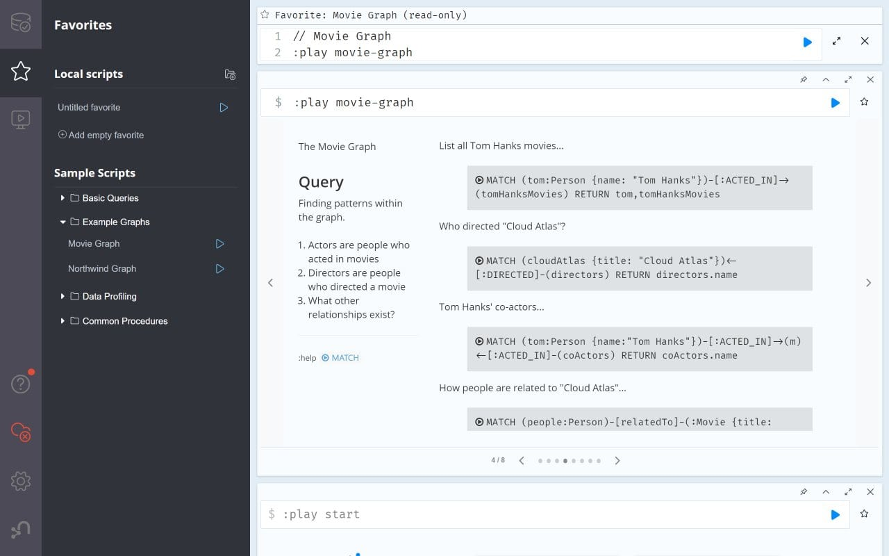

# Neo4j CI/CD pipeline

Deploy Neo4j server with CI/CD on Elestio

 
 

# Once deployed ...

You can open Neo4j UI here:

    URL: https://[CI_CD_DOMAIN]
    login: neo4j
    password: [ADMIN_PASSWORD]
