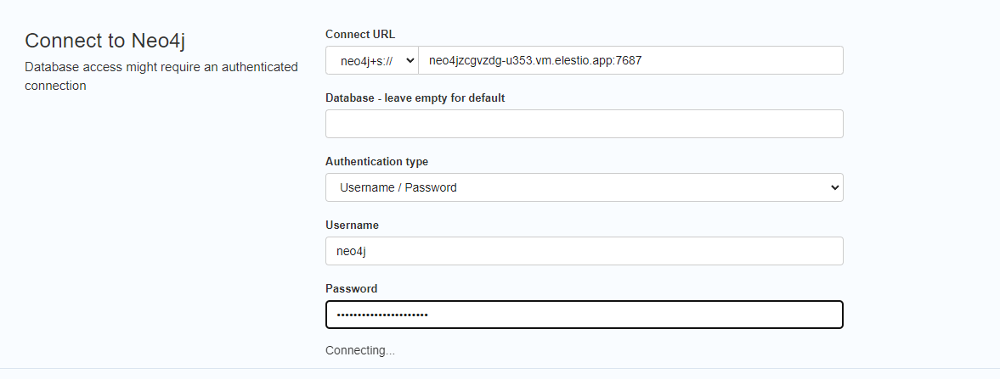

# Neo4j CI/CD pipeline

Deploy Neo4j server with CI/CD on Elestio

 
 

# Once deployed ...

You can open Neo4j UI here:

    URL: https://[CI_CD_DOMAIN]
    login: neo4j
    password: [ADMIN_PASSWORD]

# First use

On your fist connection, a screen with credentials to fill will appear.

here what you need to fill:

    Connect URL: neo4j+s://[CI_CD_DOMAIN]:7687
    Database: leave empty
    Authentication type: Username/Password
    Username: neo4j
    Password: [ADMIN_PASSWORD]

# Cypher

Cypher®, is Neo4j’s query language, including how to create and query graphs.

You can read the <a href="https://neo4j.com/docs/getting-started/appendix/tutorials/guide-cypher-basics/" target="_blank">Cypher tutorial</a> to learn how it works.

# Curl

If you want to do a curl command, here is the format to follow:

    curl -X POST -H "Content-Type: application/json" -d '{
        "statements": [
            {
                "statement": <YOUR_QUERY>
            }
        ]
    }' -u "neo4j:[ADMIN_PASSWORD]" https://[CI_CD_DOMAIN]/db/neo4j/tx/commit

For example if you have this Cypher query:

    MATCH (tom:Person)
    WHERE tom.name = "Tom Hanks"
    RETURN tom

it will be like this:

    curl -X POST -H "Content-Type: application/json" -d '{
        "statements": [
            {
                "statement": "MATCH (tom:Person) WHERE tom.name = \"Tom Hanks\" RETURN tom"
            }
        ]
    }' -u "neo4j:[ADMIN_PASSWORD]" https://[CI_CD_DOMAIN]/db/neo4j/tx/commit

# How to use from your codebase

https://neo4j.com/developer/language-guides/
